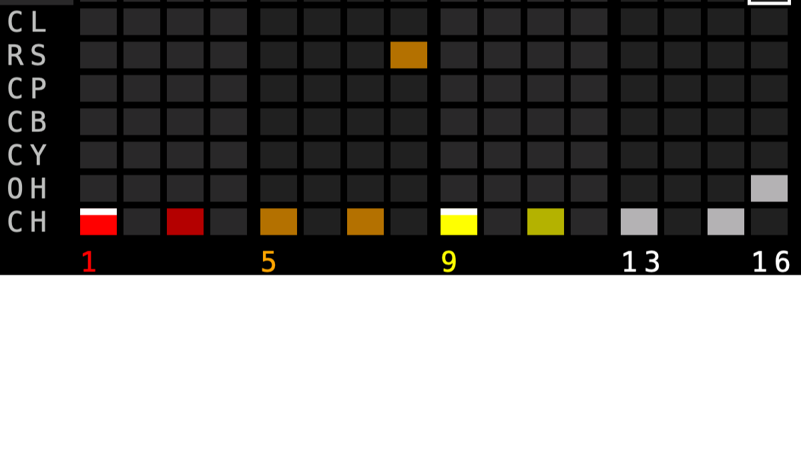
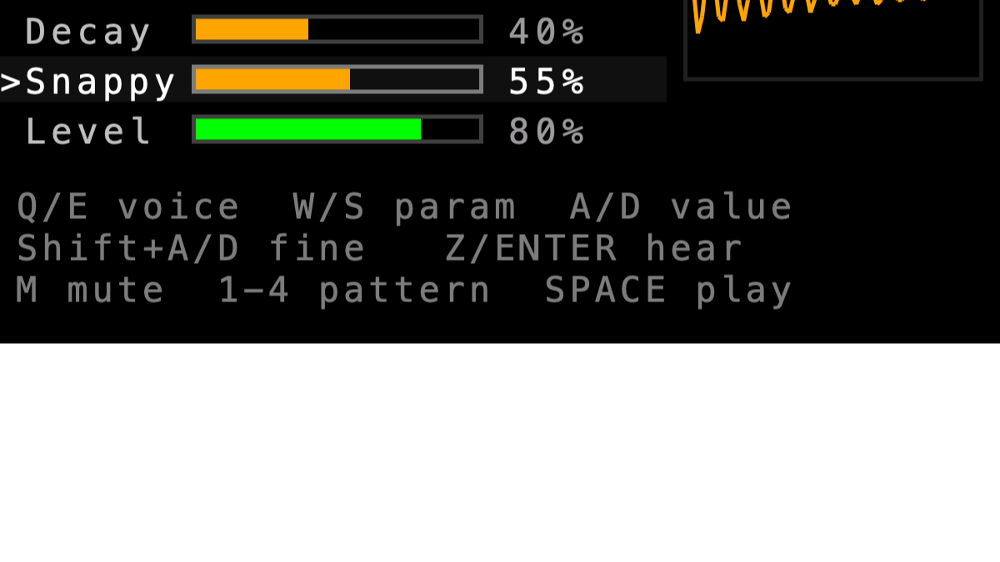

# CardputerTR808

[English](README.md) | **日本語**

[](LICENSE)

M5Stack Cardputer / Cardputer-Adv (ESP32-S3) 用の **TR-808 スタイル・リズムマシン**。
音源はすべてゼロから合成 (サンプル音源なし)、UI とエンジンを分離しているので、エンジンは PC 上でテストできます。




> 画像はホスト上のテスト (`test/ui_preview.sh`) が書き出した画面の描画で、実機の写真ではありません。

- **16 ステップ**のシーケンサー。再生ヘッドが画面の **左 → 右** に流れる (縦が音源 11 行、横がステップ 16 列)
- **4 パターン** (A–D)。再生中でも切り替えられ、小節頭で切り替わる。フラッシュに保存可能
- **11 音源**: BD SD HT LT CL RS CP CB CY OH CH
- **音源ごとの編集ページ** (Tune / Decay / 音源固有 / Level) + マスター (Volume / BPM / Swing)
- **ミュート** (音源ごと、パターンをまたいで有効、保存される)。切り替え時にクリックノイズが出ないようフェードします
- 各ステップは 消 / ON / **アクセント** の 3 状態 (アクセントは大きく鳴る。808 の ACCENT 相当)

## 必要なもの

- M5Stack **Cardputer** または **Cardputer-Adv** (ESP32-S3)
- Arduino IDE (または arduino-cli) + M5Stack ボードパッケージ (ボード: `M5Stack > M5Cardputer`) + ライブラリ **M5Cardputer**

## ビルドと書き込み

スケッチのフォルダ名は `.ino` と同じ `CardputerTR808` にしてください (Arduino IDE の決まりです)。

Arduino IDE: `CardputerTR808.ino` を開き、ボード `M5Stack > M5Cardputer` を選んで書き込み。
CLI:

```sh
arduino-cli compile --fqbn m5stack:esp32:m5stack_cardputer CardputerTR808
arduino-cli upload  --fqbn m5stack:esp32:m5stack_cardputer -p <PORT> CardputerTR808
```

## 音源

| キー | 音 | 作り | 音源固有パラメータ |
|---|---|---|---|
| **BD** | バスドラム | サイン波 + ピッチ降下 + クリック、ソフトクリップ | Click |
| **SD** | スネア | 2 つのサイン (約 180 Hz + 330 Hz) + ハイパスしたノイズ | Snappy (ノイズ量) |
| **HT** | ハイタム | サイン波 + ピッチ降下 | Click |
| **LT** | ローバム | 〃 (低い音域) | Click |
| **CL** | クラベス | 約 2.4 kHz の短い「コッ」 | Click |
| **RS** | リムショット | 低い成分 + 高い成分 + ノイズのチック | Tone (ノイズ量) |
| **CP** | ハンドクラップ | ノイズ → バンドパス、3 連打 + テール | Spread (連打の間隔) |
| **CB** | カウベル | 540 Hz / 800 Hz の 2 矩形波 → バンドパス | Tone (フィルタ) |
| **CY** | シンバル | 808 のメタルバンク (6 矩形波) → フィルタ、長い減衰 | Tone (高域/中域のバランス) |
| **OH** | オープンハット | メタルバンク → バンドパス → ハイパス | Tone (ハイパス) |
| **CH** | クローズドハット | 〃 (短い減衰)。**鳴るとオープンハットを止める (チョーク)** | Tone (ハイパス) |

全音源に `Tune` `Decay` `Level`。CY / OH / CH は 6 つの矩形波 (205.3 / 304.4 / 369.6 / 522.7 / 540 / 800 Hz、実機回路の値) を共有します。

## 操作

### シーケンサーページ (起動時の画面)

| キー | 動作 |
|---|---|
| `SPACE` | 再生 / 停止 (再生は 1 ステップ目から) |
| `W` `S` (`;` `.`) | 音源 (行) を上 / 下 |
| `A` `D` (`,` `/`) | ステップ (列) を左 / 右 (押しっぱなしでリピート) |
| `Q` `E` | 1 拍 (4 ステップ) 戻る / 進む |
| `ENTER` | カーソルのステップを **消 → ON → アクセント → 消** の順に切り替え (カーソルは動かない) |
| `DEL` | ステップを消す |
| `Z` | 選択中の音源を試聴 |
| `M` | 選択中の音源をミュート / 解除 (行のラベルに赤い取り消し線) |
| `1` `2` `3` `4` | パターン A / B / C / D を選択 (**再生中は小節頭で切り替わる**。ヘッダの緑枠が再生中、黄色が編集中) |
| `[` `]` | BPM −/+ 1 (Shift で ±10) |
| `-` `=` | マスターボリューム −/+ |
| `P` | デモグルーブを現在のパターンに読み込む (四つ打ち → ブームバップ → エレクトロ → ラテンの順) |
| `\` を 2 回 | パターンを全消去 (1 回目は確認表示のみ) |
| `K` / `L` | 保存 / 読み込み (本体のフラッシュ) |
| `TAB` / `BtnA` | ページ切替 (シーケンサー → 編集 → ヘルプ) |

ステップの色は 808 の実機と同じく 4 拍ごとに 赤 / 橙 / 黄 / 白。暗い色が ON、明るい色 + 白い帽子がアクセント。

### 編集ページ

上のタブで `BD SD HT LT CL RS CP CB CY OH CH MS` を選びます (`Q` `E` で移動、ミュート中の音源は取り消し線)。

| キー | 動作 |
|---|---|
| `Q` `E` | 前 / 次の音源 (最後は MS = マスター) |
| `W` `S` | パラメータ選択 |
| `A` `D` | 値を変更 (5 %ずつ、押しっぱなしでリピート。**Shift + A/D は 1 %ずつ**) |
| `Z` / `ENTER` | 試聴 (停止中に値を変えても自動で鳴る) |
| `M` | ミュート (MS タブではシーケンサーで選択中の音源) |

右側に直近約 90 ms のマスター波形が出ます。`1`–`4` (パターン選択) `SPACE` `[` `]` は編集ページでも使えるので、再生しながら音作りができます。

初回起動時はパターン A–D に 4 種のデモグルーブが入っています。`K` で保存すると次回起動時に復元されます
(保存内容: 4 パターン、全音色、BPM、スウィング、ボリューム、ミュート。フラッシュ書き込み中に一瞬音が途切れることがあります)。

## 構成

| ファイル | 内容 |
|---|---|
| `CardputerTR808.ino` | UI / キーボード / スピーカー / 保存 (M5 依存はここだけ) |
| `TR808Engine.h` | 11 音源 + シーケンサー + 保存フォーマット (M5 非依存 → PC でテスト可能) |
| `test/run.sh` | エンジンのテスト (`test/host_test.cpp`)。`test/run.sh wav out.wav` で全音源と 4 グルーブの試聴用 WAV を書き出し |
| `test/ui_preview.sh` | `.ino` 本体をスタブ (`test/stubs`) 越しに PC でビルドして、キー操作のテストと全画面の SVG 書き出し |
| `LICENSE` / `LICENSE-CardputerTracker` / `THIRD_PARTY_NOTICES.md` | ライセンス (下記) |

スレッド構成: Core 1 = `audioTask` (`engine.render()` → `Speaker.playRaw()`)、Core 0 = `uiTask` (キー入力・描画)。
UI → オーディオへは `post()` のリングバッファ経由です。

## テスト (PC 上、C++ コンパイラだけで実行可能)

```sh
test/run.sh          # 音源・シーケンサー・保存フォーマット
test/ui_preview.sh   # キー操作・画面レイアウト (SVG も出力)
```

`run.sh` が確認していること: 11 音源のピーク音量が揃っている / パラメータ全域 (2200 通り) で有限・有界・必ず無音に戻る /
BD・トムのピッチが下がる・Tune の範囲が表どおり / ハット類が明るく BD が暗い・減衰の順序 (CH < OH < CY) /
**CH が OH を止める** / **ミュートで無音、鳴っている音をミュートしてもクリックしない** / アクセントが通常より大きい /
**毎サンプルの `powf`/`sinf`/`expf` 呼び出しが 0 回** / 再トリガーでクリックしない /
ステップ間隔とスウィングがサンプル精度・再生ヘッドが 1→16 を順に進む・パターン切替が小節頭・4 パターンがそれぞれの内容を鳴らす /
保存データの検証 (壊れたデータは拒否)。
性能の目安は約 40 ns/サンプル (PC、11 音源すべてが全ステップで鳴る最悪ケース)。ESP32-S3 では 30–50 倍遅く見積もっても
1 サンプルの予算 (44.1 kHz で 22.7 µs) に収まります。

`ui_preview.sh` は、キー操作 (ステップの 3 状態切替、移動、パターン切替、ミュート、編集ページのタブ・パラメータ・リピート、保存/読み込み) の
検証に加えて、各画面の文字が重ならない・画面外に出ないこと、16 列 × 11 行のグリッドが画面に収まっていることを確認します。

## 動作確認の状況

PC 上のテストと Cardputer 向けのビルド (`m5stack:esp32:m5stack_cardputer`、このプロジェクトのファイルに警告なし、Flash 44 % / RAM 10 %) は通っており、作者が実機 (Cardputer) での動作を確認しています。音のキャラクター (キックの太さ、カウベルやハットの明るさなど) は 808 実機の回路の再現ではなく
「808 らしい音」を狙った自作 DSP なので、編集ページで好みに調整してください。

- サンプルレートは 44.1 kHz。実機で音が途切れる場合は `TR808Engine.h` の `TR808_SAMPLE_RATE` を `22050` にしてください
  (ホスト上のテストは 22.05 kHz でも通りますが、シンバルとハットが 2–4 dB 小さくなり、9 kHz 付近の高域は出なくなります)。
- 全体の音量は `-` `=` (または編集ページの MS → Volume)。スピーカーが歪む場合は下げてください。
- 全音源が同時に大きく鳴るとマスターのソフトクリップがかかります。

## ライセンス

このプロジェクトは **MIT ライセンス**です ([LICENSE](LICENSE))。
コードの一部は MIT ライセンスの [*Cardputer-Adv-Tracker*](https://github.com/qwertyuu/Cardputer-Adv-Tracker) の系譜を引いているため、その著作権表示を [LICENSE-CardputerTracker](LICENSE-CardputerTracker) に残しています。
ビルドに必要なライブラリ (M5Cardputer / M5Unified / M5GFX は MIT、Arduino-ESP32 コアは LGPL-2.1 と Apache-2.0 などの混在) はこのリポジトリに含まれません。
詳しい説明は [THIRD_PARTY_NOTICES.md](THIRD_PARTY_NOTICES.md) を参照してください。

「TR-808」「Roland」はローランド株式会社の商標です。本プロジェクトは個人による非公式の実装で、ローランドとは無関係であり、Roland のコード・サンプル音・画像は含みません。
